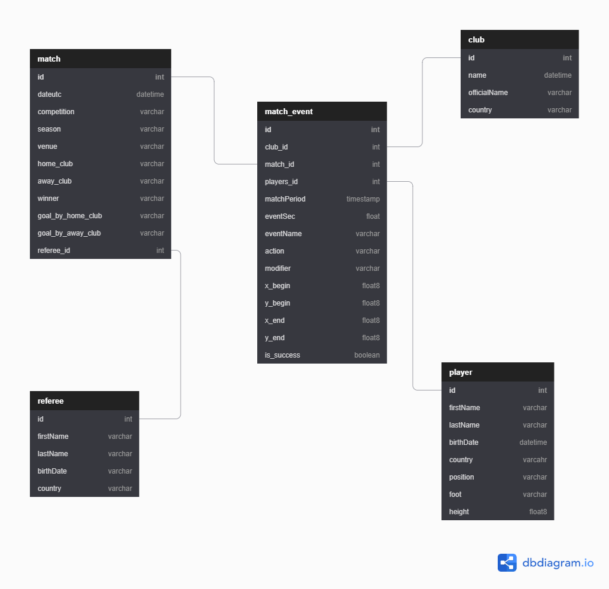

# Club Football Data

## Introduction
Club football data is an collection of data on match, player, club, referees, manager and atomic level event in competitions ranging from english premier league, series A, XX for season 2018/2019
The project involves the collation of vital club football data, this is different from the general statistics that exist on the internet such as total shots, total cards etc. This data project captures granular football match and event data including stats surrounding the events and the personnels (player, coach, referees) involved.

## Purpose
This data project aims to provide valuable insight on a club, person, match at an atomic-event level. It means analysis can be done on a given day and time under certain weather conditions, a football match is played as the nth round of the club league championship, at a given venue, between two teams with eleven starting players and a few substitutes coached by two managers, with a match referee in the middle.

An analytics dashboard can be created using the data, also the expected goal a team or player is likely to have in game can be estimated using predictive modelling on the data.

## Data source
Dataset on the team, player, referees, managers, match, competition and match event were collated and parse to extract the required data.

The data were sourced from Figshare Soccer match event data, Kaggle, and rapid footballAPI.
Referee - Contains details of referees
Players - Contain details of players in different competitions
Clubs - Contain details of clubs in different competitions
Managers - Contain details of players in different competitions
Match detail- contains match details in various competitions
Match Events - Contains micro event of match played in different competitions
Competitons = Contains list of football competitions
Additional match event data

## Data schema/model

</img>

This model is a semblance of a star schema model. It was chosen to cater for the demand on data relating toa atomic events that happens in the game of football such as a throw-in, pass or shot.

## Data Dictionary

### Fact Table

#### match_event

id - (int) - Unique Id for match event
club_id - (int) - Foreign key from club table
match_id - (int) - Foreign key from match table
player_id - (int) - Foreign key from player table
referee_id - (int) - Foreign key from referee table
matchPeriod- (string) - period of play the event tool place
eventName - (varchar) - The label of the event (pass, shot)
action - (varchar) - Specfic action of the event (simple pass, )
modifier (varchar)- Aftermath of the action (missed ball, )
eventSec - (float) - length of time the event took place
x_start - (int) - start postion of the event on the x-axis
y_start - (int) - start position of the event on the y-axis
x_end - (int) - end position of the event on the x-axis
y_end - (int) - end position of the event on the y-axis
is_success - (boolean) - Was the event successful? True or False

### Dimension table

#### match

id - (int) -  Unique Id for match
dateutc - (varchar) - Date match was played
competition - (varchar) - Type of competition
season - (varchar) - season match was played
venue - (varchar) - Venue the match was played
home_club - (varchar) - Club playing at home
away_club - (varchar) - Club playing away
winner - (varchar) - winner of the match
goal_by_home_club - (varchar) - goals scored by home club
goal_by_away_club - (varchar) - goals scored by away club
referee_id - (int) - Foreign key from referee table

#### club

id - (int) - Unique Id for club
name - (varchar) - name of club
OfficeName - (varchar) - full name description of club
country - (varchar) - name of country

#### player

id - (int) - Unique Id for player
first_name - (varchar) - player first name
last_name - (varchar) - player last name
birth_date - (datetime) -player data of birth
country  - (varchar) - player country
position - (varchar) - player position
foot - (varchar) - player preferred foot
height - (float) - player height

#### referee

id - (int) - Unique Id for Referee
first_name - (varchar) - first name of referee
last_name - (varchar) - last name of referee
birthDate - (datetime) - Date of birth of referee
country - (varchar) - Referee home country

## Methodology/Technology

Here, raw football data was stored in the S3 bucket. It consist of json and csv data files. The data in the json file is hierachical in nature so extra effort was taken to parse through the data. The event data was particularly large, over a million rows, so the power of Spark fast processing engine was employed.

Spark engine running on 3 CPU node was employed to process the large quantity of this data. The data was extracted and transformed to the required data tables according to the model. The output processed data tables were stored in parquet files on S3.

Then Airflow was employed to ETL the data from the parquet file into the analytical database Redshift, airflow was chose because it is easy to implement queries and configurations given its hookup with various systems. This involved creating a pipeline for the tasks in moving the data from S3 to Redshift (create table, load data into table and check quality of data).

Redshift partition capabilities has made it a choice to store data for analytics and machine learning project

</img>

## Steps

* Store raw football data in Amazon S3
* Run spark notebook to extract and transform the raw football data then save outuput to s3
* Run airflow dag to create tables in Redshift, copy data from s3 to redshift and check the data quality

## improvement

It is advisable to update the data per match or weekly as event data is generated every match, to avoid it being cumbersome. 

If data was increase by 100x, we would add some improvements to the dag by leveraging Spark processing as part of its task i.e including a spark script. This would automate the process of extracting, processing and loading the data, making it easier to cope with the high volume.

If the pipelines were run on a daily basis by 7am, we could make use of data pipeline technology to automate data retrieval at that time and also increase the size of the clusters nodes, allowing to cope with more frequent usage  

If the database needed to be accessed by 100+ people. The database should be partitioned to make it to run queries without lag, it helps with easy retrieval of information

